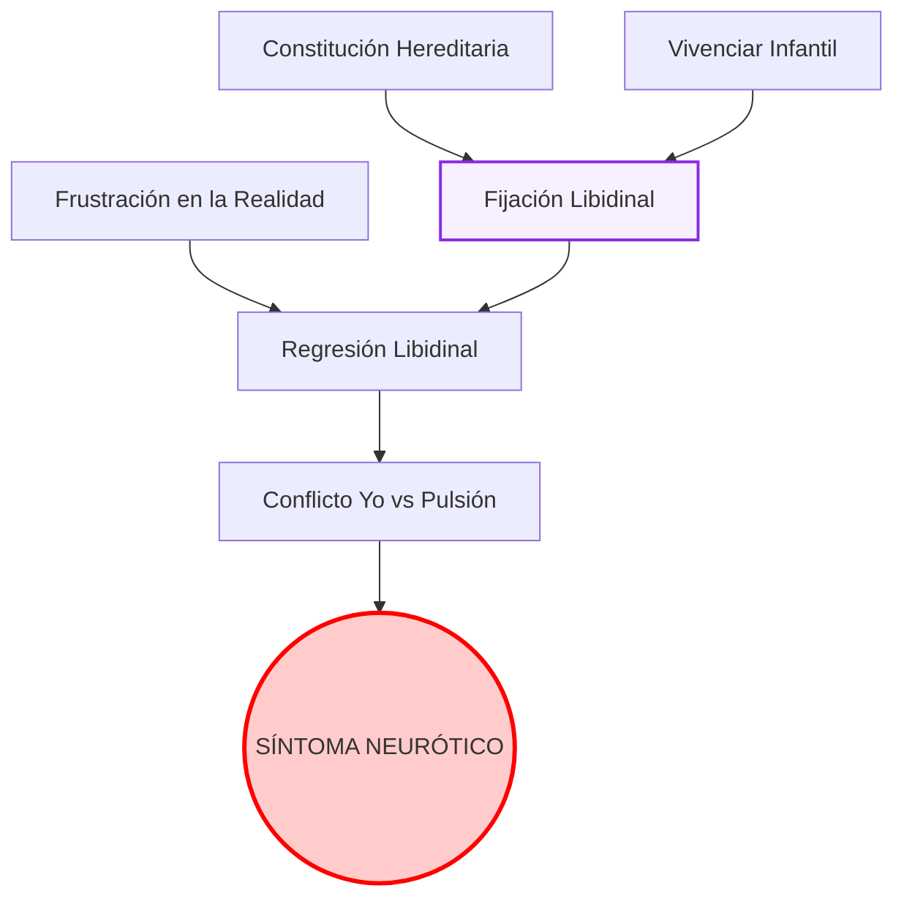

# Clase 13: Estructura y tiempos de la neurosis

Esta guía de estudio ampliada responde en profundidad a la batería de preguntas de la Clase 13, integrando aportes de Freud ("Las neuropsicosis de defensa", "23a. Conferencia") y de Belucci.

---

## 1. La primera formulación freudiana de la neurosis (Fórmula canónica)

### Desarrollo y Tesis Central
La "fórmula canónica" freudiana sobre la neurosis (formulada por primera vez en "Nuevas puntualizaciones sobre las neuropsicosis de defensa", 1896, y anticipada en "Las neuropsicosis de defensa", 1894) plantea que la causación de la neurosis no ocurre en un solo tiempo, sino que obedece a una dinámica temporal de **dos escenas**. 
El yo del sujeto se enfrenta a una representación (pensamiento o recuerdo sexual temprano) que le resulta absolutamente inconciliable. Al no poder tramitar este exceso por medio del pensamiento, la voluntad de la persona emprende una defensa (la represión), separando el afecto (la suma de excitación) de esa representación insoportable.

* **La Primera Escena (El Trauma Infantil):** Es la experiencia sexual infantil prematura. En el momento en que ocurre, no genera efecto sintomático porque el sujeto no cuenta con la madurez puberal para darle sentido sexual.
* **La Segunda Escena (El Despertar):** Un acontecimiento pospuberal inocuo por sí mismo, pero que por algún rasgo asociativo despierta la huella mnémica de la primera escena. Es ahora, retroactivamente (A posteriori), que la primera escena adquiere su carga traumática e inconciliable, desatando la defensa.

**El síntoma defensivo primario y el retorno de lo reprimido:**
Tras lograr reprimir la representación, el yo logra una aparente salud (período de salud aparente o de síntoma primario). Sin embargo, la represión requiere de un gasto constante de energía (contrainvestidura). Cuando la defensa fracasa frente a nuevas impresiones o debilitamiento yoico, se produce el **retorno de lo reprimido**. Lo que había sido desalojado retorna disfrazado en el síntoma neurótico propiamente dicho.
- En la *histeria*, el retorno (trasporte de afecto) se da a través de la inervación somática, la conversión.
- En la *neurosis obsesiva*, el retorno se da mediante el "falso enlace", donde el afecto se adhiere a representaciones lógicamente inofensivas pero que devienen compulsivas.

> [!IMPORTANT]
> *"Si en una persona predispuesta no está presente la capacidad convertidora y, no obstante, para defenderse de una representación inconciliable se emprende el divorcio entre ella y su afecto [...] su afecto, liberado, se adhiere a otras representaciones, en sí no inconciliables, que en virtud de este «enlace falso» devienen representaciones obsesivas."* (Freud, Las neuropsicosis de defensa)
> **Por qué es clave:** Esta cita define el mecanismo exacto que distancia a la obsesión de la histeria en el primer ordenamiento nosográfico de Freud.

---

## 2. Estructura y tiempos de la neurosis: Las Series Complementarias

### De la condición neurótica al padecimiento
Años más tarde, Freud (en la 23a. Conferencia) reformula y complejiza la etiología de la neurosis abandonando la idea del "trauma único" mediante el concepto de **Series Complementarias**. Este modelo postula que la neurosis no se explica por una sola causa, sino por la conjunción equilibrada de factores.

1. **Primera Serie Complementaria (La Fijación):** 
   - *Constitución Sexual Hereditaria:* Las disposiciones innatas.
   - *Vivenciar Infantil:* Los sucesos (traumáticos o no) de los primeros años de vida. 
   La suma de la constitución innata más las experiencias infantiles tempranas generan la **Fijación Libidinal**. Esta fijación representa la *condición neurótica*; el sujeto tiene un punto de anclaje patógeno, pero aún puede estar sano.

2. **Segunda Serie Complementaria (El Desencadenamiento):**
   - *La Fijación Libidinal* (resultado de la primera serie).
   - *La Frustración (Denegación) de la vida:* Un obstáculo en la vida adulta que impide la satisfacción pulsional en la realidad.
   
Cuando un sujeto, portador de una fijación, choca con una frustración severa en la vida exterior que le niega satisfacción, la libido retrocede (regresión) hacia los puntos donde quedó fijada. Es en este momento donde la libido recarga las antiguas huellas y genera conflicto con el yo, pasándose de la pura "condición neurótica" al **padecimiento neurótico** clínico (la formación de la neurosis).

> [!IMPORTANT]
> *"La constitución sexual forma con el vivenciar infantil otra «serie complementaria», en un todo semejante a la que ya conocimos entre predisposición y vivenciar accidental del adulto. Aquí como allí hallamos los mismos casos extremos y las mismas relaciones de subrogación."* (Freud, 23a. Conferencia)
> **Por qué es clave:** Resume el axioma causal del psicoanálisis: nada es puramente biológico ni puramente ambiental; se requiere el ensamble de una predisposición con el suceso precipitante.

---

## 3. El síntoma en la estructura: Caminos de la formación del síntoma

El síntoma no es un error biológico, sino un **sustituto transaccional**. Su lugar en la estructura es el de figurar una satisfacción sexual sustitutiva que se produce a espaldas del yo consciente. 

**Los caminos de la formación del síntoma:**
Cuando la libido, repelida por la frustración del mundo exterior, emprende la regresión, se encuentra con el dique del "Yo" y la represión que no la dejan manifestarse. 
Para poder salir al mundo, la libido debe negociar. Recorre entonces el camino hacia el inconsciente, catectizando fuertemente las fantasías infantiles tempranas. Como la represión impide que estas fantasías se expresen directamente, la energía psíquica sufre deformaciones (desplazamiento, condensación). 
El síntoma, entonces, es el punto final de este camino: una formación de compromiso. Permite, al mismo tiempo, una satisfacción pulsional disfrazada (proveniente del ello) y cumple con las exigencias defensivas (provenientes del yo), resultando en el sufrimiento paradójico de la neurosis.

---

## 📚 Glosario de Conceptos Clave (Skill Resumen)

| Concepto | Definición Clave en el Texto |
|----------|-----------------------------|
| **Inconciliabilidad** | Característica de una representación, generalmente sexual, que entra en total contradicción con las defensas morales del yo, motivando la represión. |
| **Enlace Falso** | Mecanismo propio de la obsesión donde el afecto, arrancado de su representación original prohibida, se asocia a una representación inofensiva dándole carácter compulsivo. |
| **Series Complementarias** | Esquema etiológico de las neurosis que articula en proporción inversa factores endógenos (constitución y vivencias infantiles = fijación) y factores exógenos (frustración adulta). |
| **Fijación Libidinal** | Retención o detención de un monto de libido en una etapa temprana del desarrollo sexual, que actúa como polo de atracción para la regresión futura. |

---

## 🗺️ Mapa Conceptual: Series Complementarias

---

## 🧠 Preguntas de Autoevaluación (Preguntas de Parcial)

1. Explique cómo el mecanismo de "enlace falso" y el "trasporte de afecto a la inervación somática" establecen la diferencia primordial entre histeria y neurosis obsesiva según el texto de 1894.
2. ¿Por qué la primera escena o vivencia sexual temprana no adquiere valor patógeno (traumático) en el mismo momento en que ocurre, y qué papel juega la segunda escena?
3. ¿De qué manera la frustración exterior o "denegación de la vida" precipita el pasaje de la condición neurótica al padecimiento clínico manifiesto?
4. Defina el concepto de "Series Complementarias" y articule cómo se compensan mutuamente la fijación libidinal y la intensidad del factor desencadenante accidental.
5. Desarrolle el proceso de regresión en la formación del síntoma: ¿Hacia qué formaciones retorna la libido al ser denegada por la realidad y cómo negocia con la represión del Yo?

---
¿Te gustaría que genere un archivo CSV con tarjetas de memoria (Flashcards) basadas en estos conceptos para que puedas importarlas a Anki?
