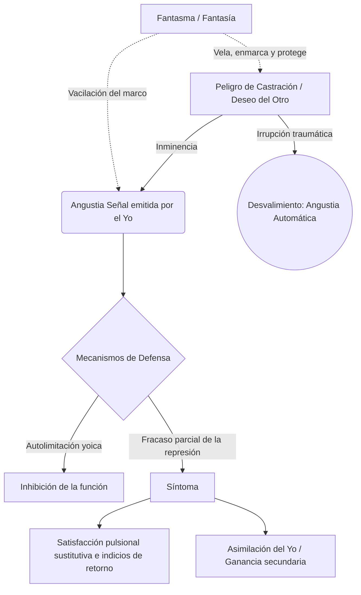

# Guía de Estudio - Clase 14: Síntoma, Fantasma y Angustia

### 1. Tesis Central
La articulación psicoanalítica entre inhibición, síntoma y angustia demuestra que la neurosis no se sostiene pasivamente en un trauma fáctico, sino en la elaboración defensiva del yo frente a un peligro. En este entramado, la fantasía (y posteriormente el fantasma en Lacan) funciona como un marco protector y un axioma lógico que inscribe el movimiento pulsional, enmascara la castración y defiende al sujeto frente a lo real (el deseo del Otro). Cuando este marco fantasmático vacila y pierde eficacia, irrumpe lo siniestro, desencadenando la angustia. Es aquí donde Freud reordena definitivamente su edificio teórico: la angustia deja de ser vista como mera libido sin descarga para ser definida como una *señal* activa del yo frente al peligro de castración, motorizando la defensa (represión) que, al fracasar, cristaliza en la formación del síntoma neurótico como formación de compromiso.

---

### Desarrollo Temático (Respuestas a las consignas)

**Momentos en la elaboración de la fantasía en Freud**
El concepto de fantasía atraviesa varias reformulaciones en la obra freudiana:
- **Cartas a Fliess (1897):** Al abandonar la primera teoría del trauma real (seducción paterna), Freud ubica a la fantasía como una *formación protectora* y ficcional. El sujeto fantasea para encubrir y no recordar un elemento verdaderamente traumático.
- **Mis tesis sobre... (1905):** La fantasía pasa a ser mediadora entre la pulsión y el síntoma. Invierte la actividad pulsional (otorgando pasividad al sujeto) y le brinda una *dimensión escénica* a la pulsión.
- **Introducción del narcisismo (1914):** A diferencia de las neurosis narcisistas (psicosis) y la melancolía, en las neurosis de transferencia la fantasía permite que el objeto se conserve en su exterioridad y separación, garantizando el intercambio libidinal.
- **"Pegan a un niño" (1919):** La fantasía se formaliza como una frase (estructura gramatical). Se identifican tres tiempos (el segundo, masoquista e inconsciente, es el fundamental) y se la sitúa como el precipitado, o la "cicatriz", del atravesamiento del complejo de Edipo, operando como defensa frente a la castración.

**El concepto de fantasma en Lacan y su lugar en la neurosis**
Lacan lee la fantasía freudiana y formula el *fantasma* como la respuesta primordial del sujeto frente a lo real y a la pregunta por el deseo del Otro ("¿Qué me quiere?"). Escrito con el matema **($ <> a)**, conjuga lógicamente al sujeto dividido y al objeto *a*. Ocupa el lugar de sostén o axioma de la neurosis: es el marco o "ventana" a través de la cual el neurótico percibe la realidad de un modo pacificado y reglado. Su función en la estructura es velar la dimensión angustiante de la castración del Otro, armando una escena donde se supone una complementariedad ilusoria (pagando a menudo el precio de la posición sacrificial o masoquista).

**Caracterización de la inhibición y su función**
Freud define la inhibición como una limitación, normal o patológica, de una función del yo (sexual, nutricia, de locomoción, laboral). Su función es esencialmente precautoria. El yo se autolimita para evitar un conflicto:
1. **Con el ello:** El órgano implicado en la función se hipererotiza. Para evitar que la acción equivalga a una satisfacción pulsional prohibida (y obligue a un nuevo trabajo represivo), el yo renuncia a la función.
2. **Con el superyó:** El yo renuncia al éxito o la función para obedecer a un mandato de autocastigo, evitando la culpa.
3. **Por empobrecimiento energético:** El yo absorbe toda su energía en un trabajo psíquico inmenso (ej. duelo) y detiene el resto de sus funciones.

**Concepto de síntoma, función subjetiva y aspectos**
A diferencia de la inhibición (proceso interno al yo), el síntoma es un *sustituto* y un *indicio* de una satisfacción pulsional interceptada; es el resultado de una represión que ha fracasado parcialmente. Su función subjetiva es tramitar un conflicto ineludible (formación de compromiso). Presenta un doble aspecto:
- **Extraterritorialidad:** Actúa como un cuerpo extraño, ajeno a la organización yoica, que exige constantemente satisfacción.
- **Asimilación y ganancia secundaria:** Debido a su tendencia a la síntesis, el yo intenta incorporarlo a su organización, extrayendo de él un beneficio (ej. evadir responsabilidades, autocastigo), lo que consolida su fijación y eleva la resistencia en el análisis.

**Teoría de la angustia en Freud (Fundamento y función)**
En *Inhibición, síntoma y angustia* (1926), Freud subvierte su propia teoría de 1895 (donde la angustia era pura libido insatisfecha o acumulada). Ahora, el *yo es el único almácigo de la angustia*. Diferencia dos vertientes:
- **Angustia automática (Fundamento):** Es la reacción biológica frente al estado de desvalimiento (el trauma), donde irrumpe un exceso de estímulos inasimilables. Su arquetipo biológico es el acto del nacimiento.
- **Angustia señal (Función):** Es una reacción anticipatoria del yo, producida voluntariamente en pequeñas dosis cuando percibe la inminencia de una situación de peligro. Esta señal moviliza el principio de placer/displacer para disparar la represión y la huida.
En cuanto a la tesis de que **"toda angustia es angustia de castración"**, Freud aclara que el peligro de castración es el paradigma de las fobias y la neurosis obsesiva (fase fálica). Sin embargo, advierte que el contenido del peligro muta según el desarrollo del yo: pérdida del objeto materno (infancia temprana), pérdida de amor, castración, y finalmente la angustia social o frente al superyó. Todas comparten el denominador común de exponer al sujeto al desvalimiento.

**Articulación: síntoma, fantasma y angustia (Angustia y defensa)**
La relación entre estos tres elementos es clínica y estructural. El fantasma funciona sosteniendo la realidad sin angustia. Cuando este marco vacila —cuando irrumpe lo ominoso (*Unheimliche*) o el objeto *a* en lo real—, el sujeto queda frente a frente con el peligro. Allí, el yo emite la **angustia como señal**, la cual es el motor fundamental de la **defensa**. 
Es decir: **la angustia crea a la represión (defensa), y no a la inversa**. Como fruto de este movimiento defensivo, surge el **síntoma**, el cual tiene la tarea de ligar esa angustia (sustituyendo el peligro pulsional interno por un objeto evitable, como en la fobia) para que el sujeto no quede aplastado en el terror del desvalimiento.

---

### 2. Glosario de Conceptos Clave

| Concepto | Definición Clave en el Texto |
|----------|-----------------------------|
| **Fantasma ($ <> a)** | Matema lacaniano que articula al sujeto dividido en relación de conjunción y disyunción con el objeto *a*. Opera como axioma, marco de la realidad y protección frente a lo real y la castración. |
| **Inhibición** | Limitación funcional del yo provocada por razones de precaución (evitar conflictos con el ello hipererotizado o con el superyó) o por empobrecimiento energético. |
| **Síntoma** | Sustituto e indicio de una satisfacción pulsional interceptada producto de la represión. Es una formación de compromiso que el yo suele incorporar secundariamente (ganancia secundaria). |
| **Angustia Señal** | Afecto desprendido activamente por el yo para advertir sobre la inminencia de un peligro (p. ej., castración), motorizando la puesta en marcha de los mecanismos de defensa (represión). |
| **Angustia Automática** | Reacción afectiva directa frente a una situación traumática de desvalimiento absoluto, análoga al trauma original del nacimiento (exceso de excitaciones). |
| **Objeto *a* (en la angustia)** | Dimensión irrepresentable y no simbolizable del objeto que se presenta como "lo que no engaña" (certeza de lo real) cuando el marco del fantasma pierde su eficacia protectora. |

---

### 3. Citas Críticas

> [!IMPORTANT]
> "En ambos casos, el motor de la represión es la angustia frente a la castración [...] Aquí la angustia crea a la represión y no —como yo opinaba antes— la represión a la angustia." *(S. Freud, Inhibición, síntoma y angustia)*
> *Por qué es clave:* Consagra el viraje teórico más radical en la teoría freudiana sobre la angustia. La angustia deja de ser entendida como un subproducto tóxico de la represión para erigirse en su causa fundamental (la angustia señal como motor de la defensa).

> [!IMPORTANT]
> "La angustia, de todas las señales, es la que no engaña. De lo real, pues, del modo irreductible bajo el cual dicho real se presenta en la experiencia, de eso es la angustia señal." *(J. Lacan, Seminario 10)*
> *Por qué es clave:* Desmitifica la idea clásica de que la angustia "no tiene objeto". Para Lacan, la angustia surge ante la certeza imborrable de lo real (la proximidad excesiva del objeto *a*), deshaciendo la trama engañosa del mundo significante.

> [!IMPORTANT]
> "El fantasma no es sólo una formación que permite que se conserve el objeto, sino que permite que haya entre el yo y el objeto un intercambio libidinal [...] supone una complementariedad posible, sin borrar que hay corte, hay separación." *(G. Belucci)*
> *Por qué es clave:* Resume la doble operación lógica del fantasma (conjunción y disyunción simultáneas) y explica por qué esta formación tiene un poder tan masivo y pacificador en la economía de la neurosis.

---

### 4. Mapa Conceptual

---

### 5. Preguntas de Autoevaluación

1. ¿De qué manera el recorrido freudiano sobre la fantasía (desde las *Cartas a Fliess* hasta *"Pegan a un niño"*) funda el terreno teórico para la posterior formalización lacaniana del fantasma?
2. Explique la diferencia estructural, metapsicológica y económica entre la "angustia automática" y la "angustia señal" según los planteos de Freud a partir de 1926.
3. Desarrolle cómo argumenta Lacan, en el Seminario 10, la tesis de que la angustia "no es sin objeto", articulando este fenómeno clínico con el marco (*frame*) del fantasma y la dimensión de lo siniestro (*Unheimliche*).
4. Diferencie conceptual y lógicamente la *inhibición* del *síntoma* tomando en cuenta los procesos de formación, las instancias involucradas (yo, ello, superyó) y el nivel de conflicto.
5. Desarrolle y fundamente la tesis freudiana de que "la angustia crea a la represión" y explique cómo este postulado invierte su primera teoría psicopatológica respecto a las neurosis de angustia.

---

¿Te gustaría que genere un archivo CSV con tarjetas de memoria (Flashcards) basadas en estos conceptos para que puedas importarlas a Anki?
