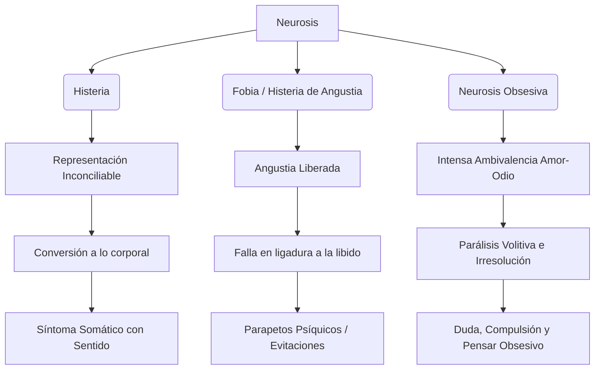

# Guía de Estudio - Clase 15
*Basado en los textos: 07 (Fobia), 10 (Histeria) y 11 (Neurosis Obsesiva) de Sigmund Freud.*

### 1. Tesis Central
Los textos analizados establecen las bases diagnósticas y metapsicológicas de las neurosis freudianas a partir del destino de la excitación pulsional y la defensa. Freud demuestra que la **histeria** resuelve el conflicto psíquico mediante la conversión de la excitación en síntomas somáticos; la **neurosis obsesiva** sustituye la acción por el pensar obsesivo, generando compulsión y duda como resultado de una intensa ambivalencia afectiva (amor-odio); y la **fobia** (histeria de angustia) libera la libido como angustia flotante, requiriendo la construcción de parapetos psíquicos (evitaciones) para su control.

### Análisis de las Preguntas del Usuario (Aplicación Clínica)

* **¿Qué particularidades tiene el síntoma en cada una de las modalidades de la neurosis?**
  * **Histeria:** El síntoma se forma por la vía de la conversión. La suma de excitación se traspone a lo corporal y se suelda con un sentido psíquico.
  * **Neurosis Obsesiva:** El síntoma se presenta como "pensar obsesivo", acciones compulsivas y duda extrema. Es un intento de resolver y a la vez expresar la parálisis volitiva causada por el conflicto entre el amor y el odio intenso.
  * **Fobia (Histeria de angustia):** El síntoma no tiene conversión somática; la angustia no puede ligarse y el sujeto debe crear "parapetos psíquicos" (precauciones, inhibiciones, prohibiciones) que operan como fobias para evitar el surgimiento de la angustia.

* **¿Cómo se organizan las distintas posiciones con respecto a la demanda y el deseo en la histeria, neurosis obsesiva y fobia?**
  * *El autor no aborda este concepto en el texto analizado.* (Los conceptos estructurales de "demanda" y "deseo" en este sentido específico corresponden a la enseñanza de J. Lacan. Los textos freudianos abordan el conflicto en términos de pulsión, libido, represión, y amor-odio).

* **¿Qué variantes asume la pregunta en la histeria y en la neurosis obsesiva? ¿Qué sucede en el caso de las fobias?**
  * *El autor no aborda este concepto en el texto analizado.* (La formulación de "la pregunta" histérica u obsesiva no figura en estos textos de Freud).

* **Refiérase a las versiones del padre particulares de la histeria y neurosis obsesiva y a su relación con la posición del sujeto. ¿Qué sucede con el padre en la fobia?**
  * En la **neurosis obsesiva** (Texto 11), Freud ubica al padre como el centro del conflicto ambivalente. El sujeto experimenta un intenso amor y un intenso odio inconsciente hacia él, generando deseos de muerte que luego se intentan expiar compulsivamente (ej. temores por el "más allá").
  * En la **histeria** (Texto 10), Freud relata dinámicas donde la paciente (Dora) se siente sacrificada o traicionada por el padre en el contexto de las relaciones con otras figuras (los K.), usándolo para encubrir corrientes homosexuales inconscientes. Sin embargo, no se sistematiza el concepto de "versiones del padre".
  * En la **fobia**, para el fragmento analizado (Texto 07 - Epicrisis), *el autor no aborda este concepto en el texto analizado*.

* **¿Qué posiciones se pueden ubicar en la histeria y en la neurosis obsesiva en relación a la escena? ¿Qué particularidad plantea la fobia?**
  * *El autor no aborda este concepto en el texto analizado.* (Si bien Freud menciona el impacto de la escena infantil traumática o fantaseada, la posición estructural frente a "la escena" no es un concepto desarrollado en estos apartados).

### 2. Glosario de Conceptos Clave

| Concepto | Definición Clave en el Texto |
|----------|-----------------------------|
| **Conversión** | Mecanismo por el cual la suma de excitación de una representación inconciliable es traspuesta a la inervación motriz o sensorial corporal en la histeria. |
| **Parapetos Psíquicos** | Construcciones protectoras (precauciones, inhibiciones, prohibiciones) que bloquean el desarrollo de la angustia en la fobia. |
| **Pensar Obsesivo** | Pensamientos compulsivos que subrogan a las acciones regresivamente, impulsados por la parálisis de la decisión. |
| **Duda (Obsesiva)** | Percepción interna de la irresolución volitiva consecuencia de la inhibición del amor por el odio; suele desplazarse a acciones ínfimas. |
| **Ambivalencia (Amor-Odio)** | Coexistencia crónica de amor y odio hacia la misma persona, ambos sentimientos en intensidad máxima, frecuente en la neurosis obsesiva. |
| **Demanda / Deseo estructural** | *El autor no aborda este concepto en el texto analizado.* |
| **Pregunta / Escena** | *El autor no aborda este concepto en el texto analizado.* |

### 3. Citas Críticas

> [!IMPORTANT]
> "En la histeria, el modo de volver inocua la representación inconciliable es trasponer a lo corporal la suma de excitación, para lo cual yo propondría el nombre de conversión."
> *Por qué es clave:* Define el mecanismo metapsicológico esencial y distintivo de la sintomatología histérica.

> [!IMPORTANT]
> "No le queda más alternativa que bloquear cada una de las ocasiones posibles para el desarrollo de angustia mediante unos parapetos psíquicos de la índole de una precaución, una inhibición, una prohibición; y son estas construcciones protectoras las que se nos aparecen como fobias..."
> *Por qué es clave:* Demuestra que el objeto fóbico es una construcción secundaria que intenta frenar la angustia liberada.

> [!IMPORTANT]
> "Si un amor intenso se contrapone, ligándolo, a un odio de fuerza casi pareja, la consecuencia inmediata tiene que ser una parálisis parcial de la voluntad, una incapacidad para decidir en todas las acciones en que el amor deba ser el motivo pulsionante."
> *Por qué es clave:* Freud halla en este intenso conflicto de opuestos el núcleo etiológico de la duda y la parálisis obsesiva.

### 4. Mapa Conceptual

### 5. Preguntas de Autoevaluación

1. ¿De qué manera distingue Freud el destino del afecto y la formación de síntoma en la histeria de conversión respecto de la histeria de angustia?
2. Explique cómo el síntoma histérico se apoya en una "solicitación somática" para expresar un sentido psíquico múltiple.
3. Según el historial clínico analizado, ¿cómo interviene el odio inconsciente y el amor en la instauración de la parálisis y la duda del neurótico obsesivo?
4. ¿Qué función metapsicológica cumplen los parapetos psíquicos (prohibiciones e inhibiciones) en la clínica de la fobia?
5. ¿De qué modo la represión opera sobre la representación obsesiva originaria, llevando a que el enfermo experimente un "pensar" despojado o desfigurado?
