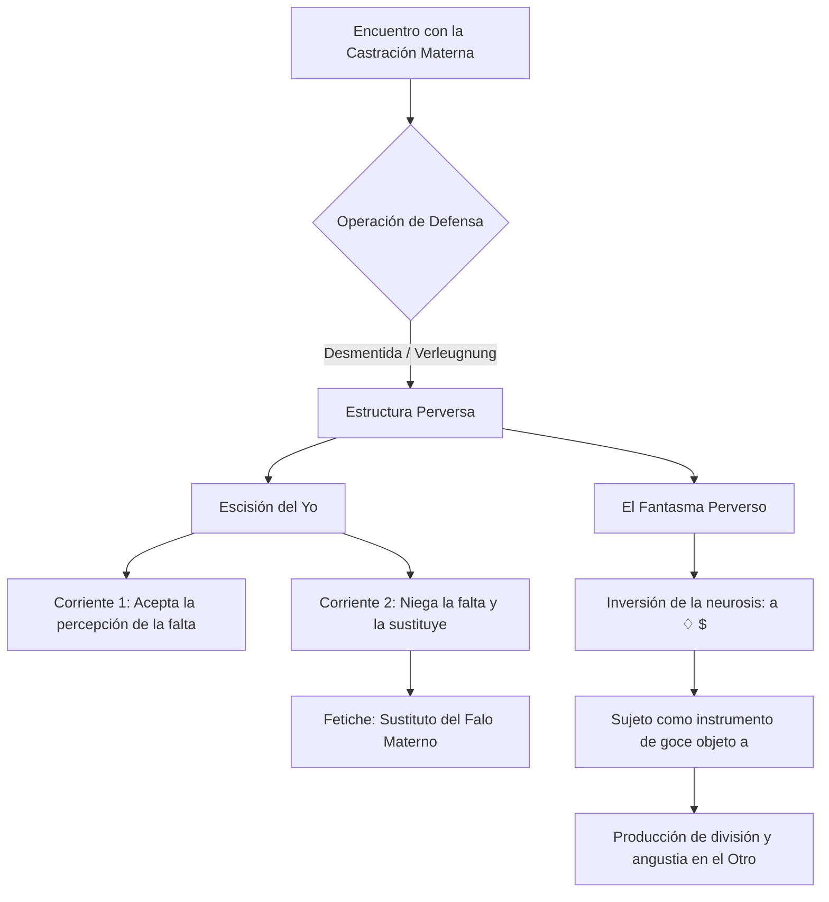

# Guía de Estudio: Clase 16 - La Perversión en Freud y Lacan

### 1. Tesis Central
La conceptualización de la perversión en psicoanálisis no es estática, sino que atraviesa distintos momentos teóricos. En Freud, la comprensión del fenómeno transita desde considerarlo un déficit de los diques pulsionales y un subproducto del complejo de Edipo, hasta su postulación definitiva centrada en la desmentida (*Verleugnung*) de la castración materna y la consecuente escisión del yo, ejemplificada nítidamente en el fetichismo. Por su parte, la elaboración lacaniana formaliza esta posición diferenciándola radicalmente de la neurosis mediante la lógica de la inversión: si para Freud la neurosis es el negativo de la perversión, Lacan demuestra que en esta última el sujeto invierte la fórmula del fantasma ubicándose como objeto (*a*) para causar la división ($) y la angustia en el Otro. Así, la perversión se erige como una demostración y una "voluntad de goce" que, sabiendo de la castración, intenta desmentirla. Asimismo, cabe destacar que, a diferencia de las psicosis, la perversión constituye estructuralmente una respuesta religiosa ante lo real, en tanto apela y se sostiene en la garantía del padre.

#### Desarrollo Analítico: Respuestas a los interrogantes fundamentales

**¿Cómo puede pensarse la relación entre perversión y neurosis? La referencia a la inversión.**
La relación parte de la célebre formulación freudiana en los *Tres ensayos*: la neurosis es el "negativo" de la perversión (metáfora fotográfica donde los síntomas neuróticos reprimen lo que el perverso actúa abiertamente). Asimismo, se evidencia una inversión de la "idealización": en la neurosis, el ideal restringe y prohíbe la satisfacción; en la perversión, la facilita. Lacan lleva esta inversión a su estatuto lógico en el fantasma. Mientras en la neurosis el sujeto dividido se dirige al objeto ($ ♢ a), en la perversión la estructura se invierte (a ♢ $). El perverso se ubica como objeto e instrumento para producir la división y la angustia en su partenaire neurótico.

**Los tres momentos en la conceptualización freudiana y la operación constitutiva:**
1. *Primer momento (Tres ensayos, 1905):* Centrado en la **pulsión parcial**. La perversión se concibe como un déficit de represión, donde componentes pulsionales (ej. voyeurismo) cobran autonomía frente a la síntesis genital.
2. *Segundo momento (1919-1924):* Centrado en el **complejo de Edipo y el padre**. En textos como *Pegan a un niño* y *El problema económico del masoquismo*, la fantasía perversa se inscribe en la trama edípica ligada al amor incestuoso y la culpa.
3. *Tercer momento (Fetichismo, 1927):* Centrado en el **complejo de castración**. Aquí Freud ubica la operación específica y constitutiva de la posición perversa: la **Verleugnung (desmentida)**. El sujeto rehúsa aceptar la castración materna, produciendo una escisión en el yo para sostener simultáneamente el reconocimiento y la negación de esta falta.

**Los dos momentos de la conceptualización lacaniana de la perversión:**
1. *Primer momento (Seminarios 4 y 6):* Centrado en el **falo imaginario** (Teoría normalizadora). El paradigma es el fetichismo. La perversión es leída como una solución atípica del tránsito edípico en la cual el sujeto se resiste a abandonar la posición imaginaria de ser el falo que colmaría el deseo de la madre.
2. *Segundo momento (Seminario 16):* Centrado en el **objeto a** y el goce. El paradigma pasa a ser el masoquismo. El perverso opera con una "voluntad de goce", orientándose enteramente hacia el Otro; se ubica como instrumento (*a*) para restituir un goce perdido al Otro, buscando ineludiblemente provocar la angustia en su partenaire como signo de división.

### 2. Glosario de Conceptos Clave
| Concepto | Definición Clave en el Texto |
|----------|-----------------------------|
| **Verleugnung (Desmentida)** | Operación específica y constitutiva de la perversión donde el sujeto rehúsa darse por enterado de la castración en la mujer, sabiendo de la falta pero actuando como si no existiera. |
| **Escisión del Yo** | Desgarro psíquico producto de la desmentida; coexisten dos actitudes independientes frente a la realidad de la castración materna (una reconoce el hecho y otra lo niega creando el fetiche). |
| **Fetiche** | Sustituto del falo materno (del pene de la mujer) en el que el varoncito ha creído en su infancia y al cual se niega a renunciar para protegerse del terror a su propia castración. |
| **Fantasma Perverso (a ♢ $)** | Inversión topológica del fantasma neurótico propuesta por Lacan, donde el perverso se sitúa en el lugar del objeto (a) para provocar la división y la angustia ($) en el partenaire. |
| **Voluntad de Goce** | Posición perversa que, a diferencia del neurótico que goza sin saberlo y con sufrimiento, no retrocede ante el principio de placer, asumiendo la satisfacción como un mandato dirigido a restituir el goce al Otro. |

### 3. Citas Críticas
> [!IMPORTANT]
> "Para decirlo con mayor claridad: el fetiche es el sustituto del falo de la mujer (de la madre) en que el varoncito ha creído y al que no quiere renunciar —sabemos por qué—."
> *Por qué es clave:* Freud (1927) define aquí con exactitud el estatus del fetiche, ligando la perversión estructuralmente al complejo de castración y al pánico por la pérdida narcisista del propio órgano.

> [!IMPORTANT]
> "La ha conservado, pero también la ha resignado; en el conflicto entre el peso de la percepción indeseada y la intensidad del deseo contrario se ha llegado a un compromiso [...] Sí, en lo psíquico la mujer sigue teniendo un pene, pero este pene ya no es el mismo que antes era."
> *Por qué es clave:* Muestra el mecanismo nuclear de la *Verleugnung* y la resultante escisión del yo, revelando que en la perversión coexisten de manera funcional el saber de la castración y su desmentida.

> [!IMPORTANT]
> "El perverso se sitúa en el lugar del objeto, y desde ese lugar promueve la división del sujeto (su partenaire) y busca producir la angustia como signo de esa división."
> *Por qué es clave:* Sintetiza el viraje de Lacan respecto a Freud, ubicando la perversión no como un mero acto de "egoísmo" instintivo, sino como un montaje lógico orientado a interpelar radicalmente la falta del Otro mediante la inversión del fantasma.

### 4. Mapa Conceptual

### 5. Preguntas de Autoevaluación
1. ¿De qué manera la fórmula freudiana de "la neurosis como negativo de la perversión" sienta las bases para la posterior teorización lacaniana sobre la inversión topológica del fantasma?
2. Explique en profundidad la operatoria de la *Verleugnung* (desmentida) en el texto freudiano de 1927 y su vinculación ineludible con el complejo de castración.
3. ¿Cómo se manifiesta clínicamente la escisión del yo en el sujeto fetichista y de qué manera esta división resuelve el conflicto psíquico frente al terror a la castración?
4. Diferencie analíticamente los tres momentos lógicos en la conceptualización freudiana de las perversiones (déficit de pulsión parcial, entramado edípico y desmentida de la castración).
5. Contrastando los dos momentos de la enseñanza de Lacan sobre la perversión, ¿qué diferencia estructural y clínica existe entre situar el eje explicativo en el falo imaginario frente a situarlo en la función del objeto *a* y la "voluntad de goce"?
