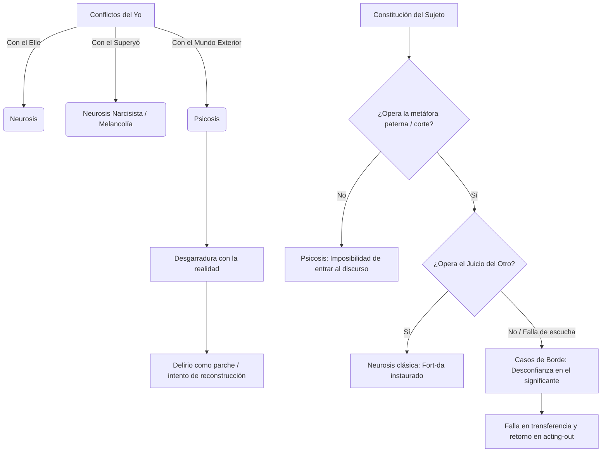

# Guía de Estudio: Clase 17 y 18 (Textos 13 y 21)

## Respuestas a las Preguntas Guía

**- Desarrolle el concepto de forclusión del Nombre-del-Padre. ¿Cuáles son sus consecuencias estructurales?**
El autor no aborda el concepto de "forclusión del Nombre-del-Padre" explícitamente en los textos analizados. Sin embargo, H. Heinrich (Texto 21) señala que en la psicosis "la metáfora paterna no ha operado". Su consecuencia estructural principal es que "el corte con el Otro no se produjo", lo que impide la instalación del *Fort-da* y genera "una imposibilidad lógica de entrada en el discurso".

**- Refiérase al concepto de «fenómeno elemental» y a su importancia para el diagnóstico de psicosis.**
El autor no aborda este concepto en los textos analizados.

**- ¿Qué soluciones o recursos son posibles para un sujeto de condición psicótica ante las consecuencias de la forclusión del Nombre-del-Padre?**
El autor no aborda el término "soluciones" ligado a la forclusión en los textos analizados. No obstante, S. Freud (Texto 13) explica que, ante la frustración insoportable y la ruptura con el mundo exterior, el yo "se crea, soberanamente, un nuevo mundo exterior e interior". En este marco, el **delirio** opera como recurso: se presenta como un "parche colocado en el lugar donde originariamente se produjo una desgarradura", constituyendo un "intento de curación o de reconstrucción".

**- ¿Bajo qué condiciones y de qué modos pueden producirse rupturas en las soluciones psicóticas?**
El autor no aborda las "rupturas en las soluciones psicóticas" en los textos analizados. Freud (Texto 13) se limita a indicar que la condición general para el "estallido" de una psicosis (o neurosis) es la frustración externa o el no cumplimiento de deseos infantiles. 

**- ¿Qué criterios clínicos y lógicos permiten el diagnóstico de una psicosis no desencadenada?**
El autor no aborda este concepto en los textos analizados. H. Heinrich menciona presentaciones clínicas de "bordes", donde sí hay un trauma inscrito pero una falta de confianza en el significante debido a un Otro "sordo", pero no desarrolla criterios para la psicosis no desencadenada.

---

### 1. Tesis Central
La presente guía articula dos abordajes clínicos de los conflictos estructurales. Por un lado, Freud establece la diferencia genética entre neurosis y psicosis a partir del vasallaje del yo: la neurosis es producto de un conflicto entre el yo y el ello, mientras que la psicosis resulta de una ruptura del vínculo entre el yo y el mundo exterior, donde el delirio aparece como un parche restitutivo. Por otro lado, Heinrich analiza los cuadros clínicos de "Borde" a partir de las fallas del "Juicio del Otro"; si el Otro no convalida la alternancia presencia-ausencia (el *Fort-da*) con su escucha, se produce una falta de confianza en el significante que dificulta la entrada en transferencia y hace que el sujeto responda al trauma mediante actuaciones y *acting-out* en lugar de formaciones del inconsciente.

### 2. Glosario de Conceptos Clave
| Concepto | Definición Clave en el Texto |
|----------|-----------------------------|
| **Neurosis** | Resultado de un conflicto entre el yo y el ello, donde el yo se defiende de una moción pulsional mediante la represión (Freud). |
| **Psicosis** | Desenlace de una perturbación en los vínculos entre el yo y el mundo exterior, donde el yo se crea un nuevo mundo (Freud). |
| **Neurosis narcisista (Melancolía)** | Afección en cuya base se encuentra un conflicto entre el yo y el superyó (Freud). |
| **Delirio** | Parche colocado en el lugar donde originariamente se produjo una desgarradura en el vínculo del yo con el mundo exterior; un intento de curación o reconstrucción (Freud). |
| **Juicio del Otro** | Convalidación y escucha por parte del Otro que acepta que hay un Sujeto diciendo algo. Es condición necesaria para instituir la confianza en el significante y el *Fort-da* (Heinrich). |
| **Borde(r)s** | Posición donde el trauma actuó y el corte operó, pero el *Fort-da* se inscribe con desconfianza por una falla en el Juicio del Otro, manifestándose en *acting-out* y adicciones (Heinrich). |

### 3. Citas Críticas
> [!IMPORTANT]
> "La neurosis es el resultado de un conflicto entre el yo y su ello, en tanto que la psicosis es el desenlace análogo de una similar perturbación en los vínculos entre el yo y el mundo exterior."
> *Por qué es clave:* Fundamenta la primera nosología freudiana basada en los conflictos de las instancias del aparato psíquico y su relación con la realidad.

> [!IMPORTANT]
> "el delirio se presenta como un parche colocado en el lugar donde originariamente se produjo una desgarradura en el vínculo del yo con el mundo exterior."
> *Por qué es clave:* Desmitifica al delirio como el núcleo de la enfermedad, ubicándolo teóricamente como un esfuerzo restitutivo y un intento de curación.

> [!IMPORTANT]
> "en la psicosis el corte con el Otro no se produjo, con lo cual tampoco se produce el Fort-da. En la neurosis, el trauma actuó y el Fort-da también; y hay un borde, en el que tal vez el trauma se haya producido y el Fort-da no."
> *Por qué es clave:* Permite distinguir lógicamente la psicosis (ausencia de metáfora paterna) de las neurosis de borde, donde el fracaso recae en la simbolización de la ausencia.

> [!IMPORTANT]
> "Vemos la necesariedad del Juicio del Otro para que se instale la confianza en el significante, y por ende la transferencia."
> *Por qué es clave:* Subraya que la instauración del sujeto en el discurso no depende solo de un esfuerzo individual, sino de un Otro que escucha e interpreta.

### 4. Mapa Conceptual

### 5. Preguntas de Autoevaluación
1. Según S. Freud, ¿cuál es la diferencia genética fundamental entre la neurosis de transferencia, la psicosis y la neurosis narcisista?
2. Explique qué función estructural cumple el delirio en el estallido de una psicosis, de acuerdo al planteo de Freud en "Neurosis y psicosis".
3. ¿Cómo define H. Heinrich el "Juicio del Otro" y por qué resulta indispensable para la instauración del *Fort-da*?
4. Trazando paralelos según Heinrich, ¿qué diferencia estructural y lógica existe entre una psicosis y un caso de "borde" respecto del trauma y el corte con el Otro?
5. ¿Qué consecuencias clínicas tiene para el tratamiento (y la demanda de análisis) que el sujeto se haya enfrentado a un Otro "sordo" durante su constitución?
