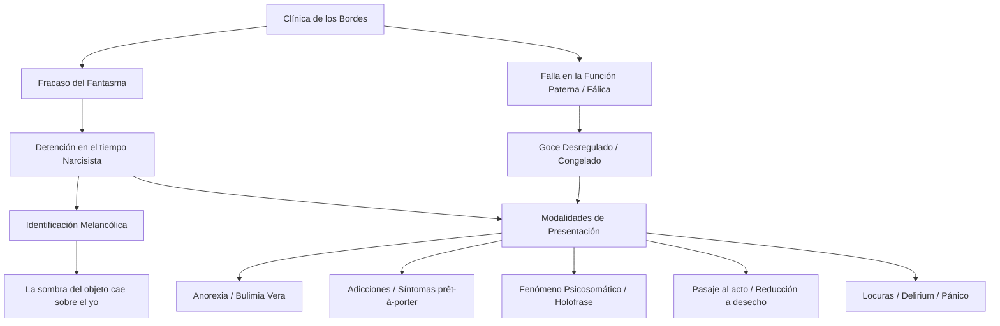

### 1. Tesis Central

La «clínica de los bordes» (o de los fracasos del fantasma) reúne una serie de presentaciones patológicas contemporáneas (anorexias, bulimias, adicciones, fenómenos psicosomáticos, pasajes al acto y "locuras" histéricas) que comparten una estructura subyacente: el fracaso en la constitución y operatividad del fantasma fundamental. A diferencia de la neurosis clásica, donde el fantasma protege frente a la angustia ofertando un objeto parcial, en estos sujetos se evidencia una detención en el tiempo narcisista de la identificación y un déficit en la función paterna y fálica (sin llegar a la forclusión psicótica). Esto los deja a merced de un goce no regulado, desencadenando defensas que operan como "máscaras yoicas" (síntomas prêt-à-porter), lesiones biológicas reales, o pasajes al acto en los que el sujeto se identifica con el objeto perdido o de desecho. Clínicamente, el abordaje demanda leer allí un duelo patológico y una melancolización encubierta que amenaza permanentemente con la destrucción subjetiva.

### 2. Glosario de Conceptos Clave

| Concepto | Definición Clave en el Texto |
|----------|-----------------------------|
| **Fracaso del fantasma** | Detención del fantasma en su tiempo puramente narcisista, impidiendo la parcialización del objeto. El sujeto no puede ofrecer una falta simbólica, sino que se ofrece entero (o su desaparición) para alojarse en el Otro. |
| **Melancolización / Duelo patológico** | Retiro de la libido del objeto perdido hacia el yo, estableciendo una identificación narcisista ("la sombra del objeto cayó sobre el yo"), generando un sadismo vuelto hacia la propia persona ante la imposibilidad de tramitar simbólicamente la pérdida. |
| **Función Fálica y Paterna** | Impasse o falla (no forclusión) donde la función paterna no inscribe plenamente el límite al goce materno. Dificulta la asunción de una posición sexuada y produce un "goce congelado" o incorporal sin amarre a la ley fálica (el "banquete totémico"). |
| **Pasaje al Acto** | Conclusión abrupta de una escena con efecto de aniquilación, donde el sujeto pierde el clivaje con el objeto, despojándose de identificaciones ideales y arrojándose a la posición de *desecho* frente al goce absoluto del Otro. |
| **Holofrase / Síntoma *prêt-à-porter*** | Borramiento del intervalo entre S1 y S2 que impide interrogar el deseo del Otro, suplantado por formaciones identitarias prestablecidas por el mercado (ej. adicciones) que funcionan como "máscaras yoicas" para evitar el desmoronamiento. |
| **Anorexia / Bulimia vera** | Presentaciones donde el sujeto rechaza el alimento si este no porta el "brillo fálico" del amor (asumiendo una posición amo de cadaverización), o transigiendo con un goce pulsional obsceno y sin lazo social ("comida clandestina") en la bulimia. |

### 3. Citas Críticas

> [!IMPORTANT]
> *"La sombra del objeto cayó sobre el yo, quien, en lo sucesivo, pudo ser juzgado por una instancia particular como un objeto, como el objeto abandonado."* (Freud, Duelo y melancolía)
> *Por qué es clave:* Define el mecanismo central de la melancolía, antecedente fundamental de la clínica de los bordes, donde la falla en la elaboración de la pérdida decanta en una identificación narcisista mortífera con el objeto.

> [!IMPORTANT]
> *"La anoréxica logra la muerte en vida de una mujer que no va a suscitar la erección fálica [...] Se planta en sostener a todo precio el deseo del Otro faltándole ella misma en su cuerpo cadavérico."* (Amigo, Clínica de los fracasos del fantasma)
> *Por qué es clave:* Ejemplifica las consecuencias estructurales del fracaso del fantasma: al no contar con un abanico de objetos para significar la falta, el sujeto oferta su propio ser en una fijeza narcisista y tanática.

> [!IMPORTANT]
> *"El delirium consiste en la vacilación del fantasma... Cuando el fantasma fracasa en la función que le es propia, la de remediar el goce del Otro, el sujeto queda desamparado."* (Fernández, Algo es posible)
> *Por qué es clave:* Diferencia conceptualmente los fenómenos de "locura" en la neurosis (delirium) de los delirios de la psicosis, ubicando su causa específica en el vacío del fantasma frente a la invasión de un goce no tramitado.

> [!IMPORTANT]
> *"El sujeto va presentándose progresivamente... en posición de desecho, de resto identificado al objeto [...] Nada del Ideal queda del lado del sujeto, sino que queda totalmente del lado del Otro."* (Iunger, Clínica del pasaje al acto en la neurosis)
> *Por qué es clave:* Explica la desarticulación narcisista previa al pasaje al acto: la pérdida del Ideal del yo y la absoluta reducción del sujeto a *objeto a*, como último y desesperado intento de separación estructural.

### 4. Mapa Conceptual

### 5. Preguntas de Autoevaluación

**1. ¿Cuáles son los antecedentes freudianos de la «clínica de los bordes»? Articule con el problema de la melancolía, poniendo el acento en la relación entre pérdida e identificación.**
> **Respuesta Sugerida:** Los antecedentes se ubican en el tríptico inhibición-síntoma-angustia, el "agieren" (actuar) y formaciones clínicas como la amencia de Meynert. Su matriz teórica es la **melancolía freudiana**: ante una pérdida, fracasa el trabajo de duelo (el desasimiento libidinal). La libido se retira sobre el yo, instaurando una identificación narcisista primaria. *La pérdida del objeto se muda en una pérdida del yo*, desencadenando un sadismo feroz dirigido contra sí mismo (autocastigo).

**2. Desarrolle la idea de «fracaso del fantasma» y refiérase a sus consecuencias estructurales.**
> **Respuesta Sugerida:** El fantasma normal protege ofertando a la falta del Otro un pequeño fragmento de sí (objeto parcial). El "fracaso del fantasma" implica una detención en su tiempo puramente narcisista. Al no constituirse el intervalo (holofrase) y fallar su función de velar el goce del Otro, las consecuencias son la fijeza mortífera: el sujeto no puede parcializarse y, en su lugar, ofrece su ser entero (o su cadáver, como en la anorexia) quedando desamparado frente al imperio del Otro.

**3. ¿Qué sucede en la «clínica de los bordes» con la función paterna y con la función fálica?**
> **Respuesta Sugerida:** Hay una falla estructural en ellas, pero sin llegar a la forclusión psicótica. La **función paterna** no logra operar su "tercera identificación" (o claudica en la época actual del "padre humillado"), dejando al sujeto adherido a un goce materno. La **función fálica** sufre un impasse: no logra enmarcar el objeto ni regular el goce (el "banquete totémico"). Persiste como defensa de modo fallido, cristalizando "goces congelados" e impidiendo el acceso regulado y simbólico al deseo y la posición sexuada.

**4. ¿Qué particularidades tienen en estos sujetos el narcisismo y las identificaciones?**
> **Respuesta Sugerida:** El narcisismo se presenta sumamente frágil, oscilando entre una devaluación absoluta (desnarcisización/melancolización) y una impostación maníaca (infatuación del yo). Las identificaciones son rígidas, precarias o *prestadas* (falso self, adicciones). Especialmente en el pasaje al acto, el sujeto se despoja de toda identificación ideal (proyectada plenamente en un Otro absoluto) y se identifica trágicamente con el *objeto a* en su vertiente de puro desecho (resto inasimilable).

**5. Caracterice las principales modalidades de presentación en la «clínica de los bordes»: anorexias y bulimias, «patologías del acto», locuras, afecciones psicosomáticas, adicciones, ataque de pánico, depresiones.**
> **Respuesta Sugerida:**
> *   **Anorexia/Bulimia vera:** Rechazo al alimento que no porta la ley fálica (se cadaveriza para faltarle al Otro) o ingesta pulsional clandestina y obscena que repudia el lazo social.
> *   **Patologías del acto:** Ej., el pasaje al acto, donde se concluye abruptamente la escena; el sujeto se arroja como desecho (suicidio) para huir del goce mortífero del Otro.
> *   **Locuras / Pánico:** Momentos de *delirium* (pesadilla en vigilia) no psicóticos, que surgen como parche ante el agujero fantasmático inoperante.
> *   **Afecciones psicosomáticas:** Efecto de la holofrase, el cuerpo orgánico hace letra, decantando en una lesión celular real sin interrogar el deseo.
> *   **Adicciones:** Uso de "síntomas prêt-à-porter" del mercado; máscaras yoicas para lograr un éxtasis narcisista (infatuación) y evitar el desmoronamiento de la estructura.
> *   **Depresiones:** Marcadas siempre por la sombra del "duelo suspendido" (melancolización encubierta) y la incapacidad de simbolizar la falta.
