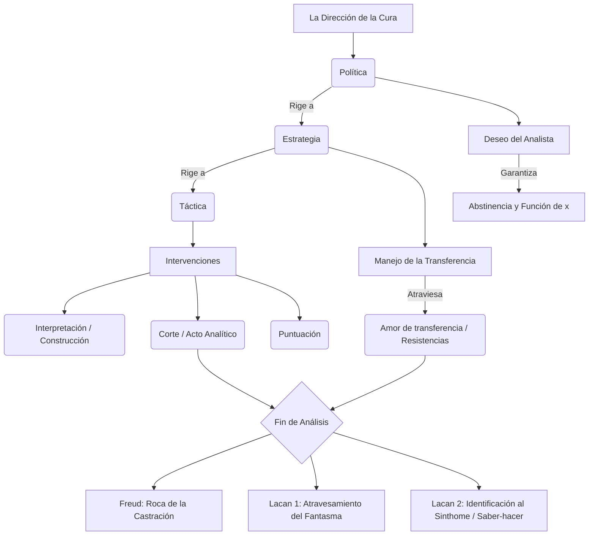

# Guía de Estudio: Dirección de la Cura, Intervenciones y Fin de Análisis (Clases 21 a 23)

### 1. Tesis Central
La dirección de la cura en psicoanálisis no es una empresa pedagógica, moral o de sugestión, sino una praxis estructurada lógicamente sobre la ética del deseo. Mientras Freud sentó las bases de la técnica (regla fundamental, abstinencia) descubriendo que la transferencia es tanto el motor de la cura como su mayor obstáculo, Lacan formaliza esta clínica ordenándola en tres dimensiones (táctica, estrategia y política). La brújula de todo el proceso es el "deseo del analista", una función vacía de todo goce personal que opera como motor absoluto de la diferencia frente a la repetición neurótica. Bajo este deseo, intervenciones como la interpretación, la construcción y el corte apuntan a atravesar el andamiaje fantasmático del sujeto, conduciéndolo más allá de la "roca de la castración" freudiana hacia un fin de análisis donde se logre un saber-hacer (*savoir-faire*) con lo incurable del síntoma.

### 2. Glosario de Conceptos Clave

| Concepto | Definición Clave en el Texto |
|----------|-----------------------------|
| **Táctica** (Lacan) | Dimensión en la que el analista es "libre" respecto al momento, número y tipo de sus intervenciones (interpretaciones, cortes), pero que está estrictamente subordinada a la estrategia clínica. |
| **Estrategia** (Lacan) | Dimensión que concierne al manejo de la transferencia, donde el analista es menos libre y debe ubicarse (como el "muerto" en el bridge) para hacer surgir el juego y el deseo del analizante. |
| **Política** (Lacan) | Dimensión rectora del análisis donde el analista es menos libre aún. Concierne a su posición ética dictada por la falta-en-ser y el Deseo del Analista, oponiéndose a la domesticación del Yo del paciente. |
| **Deseo del Analista** | Función central que hace posible la transferencia. Es un deseo de "máxima diferencia" que rompe con la repetición inerte y evita que el analista se ofrezca como ideal para la identificación del analizante. |
| **Abstinencia** (Freud) | Regla clínica por la cual el analista debe denegar la satisfacción directa (especialmente ante el "amor de transferencia"), dejando subsistir la necesidad como fuerza pulsionante para el trabajo analítico. |
| **Interpretación** | Para Freud, vía para hacer consciente lo inconsciente. Para Lacan, intervención que no apunta al sentido hermenéutico, sino que recae sobre el significante, ubicándose "entre el enigma y la cita". |
| **Construcción** (Freud) | Intervención articulada e histórica que Freud introduce para lidiar con los límites de la interpretación (como los topes de lo pulsional o lagunas mnémicas), armando piezas dispersas de la vida del sujeto. |
| **Corte / Puntuación** (Lacan) | El corte es un "acto" sobre lo real que detiene el circuito inerte y el goce masoquista ("bla bla bla") interrumpiendo la sesión. La puntuación sanciona retroactivamente el sentido en la cadena significante. |
| **Atravesamiento del fantasma** | Versión lacaniana del fin de análisis donde el sujeto advierte que su axiomática inconsciente (su respuesta a la falta del Otro) es meramente una ficción o montaje, perdiendo así su absolutismo. |
| **Sinthome / Saber-hacer** | Última versión conclusiva de Lacan: frente al núcleo incurable del síntoma, el fin no es su erradicación, sino un *savoir-faire* (saber-hacer con) que permite al sujeto anudarse singularmente sin depender del Nombre-del-Padre. |

*(Nota: Sobre el "señalamiento" consultado, el autor no aborda este concepto formalmente como entidad estructural diferenciada en los textos aquí analizados).*

### 3. Citas Críticas

> [!IMPORTANT]
> *"El eje, el punto común de esta hacha de doble filo, es el deseo del analista, que designo aquí como una función esencial. Y no me vengan a decir que no nombro ese deseo, porque es precisamente el punto que sólo es articulable por la relación del deseo con el deseo."*
> *Por qué es clave:* Fundamenta que el motor del análisis para Lacan no radica en la persona, el ego o los afectos del analista (contratransferencia), sino en una función estructurante que apunta a suscitar el deseo del analizante. (Lacan - Seminario 11)

> [!IMPORTANT]
> *"El psicoanalista sin duda dirige la cura. El primer principio de esta cura [...] es que no debe dirigir al paciente [...] La dirección de la cura consiste en primer lugar en hacer aplicar por el sujeto la regla analítica."*
> *Por qué es clave:* Lacan demarca la diferencia radical entre la ortopedia yoica o reeducación moral (dirigir al paciente) y la verdadera ética psicoanalítica basada en ordenar el dispositivo para que advenga el sujeto del inconsciente. (Lacan - La dirección de la cura)

> [!IMPORTANT]
> *"Uno debe guardarse de desviar la transferencia amorosa, de ahuyentarla o de disgustar de ella a la paciente; y con igual firmeza uno se abstendrá de corresponderle. Uno retiene la transferencia de amor, pero la trata como algo no real, como una situación por la que se atraviesa en la cura..."*
> *Por qué es clave:* Resume el principio rector de Freud sobre la abstinencia frente al amor de transferencia, concibiéndolo como repetición que debe analizarse y no como un obstáculo contingente o una demanda a satisfacer. (Freud - Puntualizaciones sobre el amor de transferencia)

> [!IMPORTANT]
> *"...en ese punto, se trata de un «saber-hacer con el síntoma», de un savoir-faire. Con eso no se trata de pretender reducirlo, porque es imposible, sino de «saber-hacer con»."*
> *Por qué es clave:* Cifra la respuesta clínica última de Lacan (vía el *Sinthome*) frente al pesimismo de la "roca de la castración" freudiana. Acepta que existe un goce irreductible, pero propone una invención singular como final de análisis. (Belucci - Versiones del fin de análisis)

### 4. Mapa Conceptual

### 5. Preguntas de Autoevaluación

*(Incluye las pautas detalladas de respuesta a los ejes planteados para el estudio de los textos)*

**Pregunta 1: Desarrolle las tres dimensiones de la práctica analítica que Lacan introduce a partir de su lectura de Von Clausewitz.**
*Pauta de respuesta:* En *La dirección de la cura*, Lacan utiliza la jerarquía táctica-estrategia-política. La **táctica** es donde el analista es más libre; se refiere al uso preciso del tiempo y la palabra (interpretación, corte, puntuación) en las sesiones. Sin embargo, está supeditada a la **estrategia**, que remite al manejo de la transferencia, donde el analista es menos libre pues debe desdoblar su persona y actuar como el "muerto" en el bridge para dejar lugar al analizado. La **política** de la cura es el nivel donde el analista es menos libre, ya que obedece a la ética del psicoanálisis: está regida por el reconocimiento de la "falta-en-ser" y apuntalada en el deseo del analista.

**Pregunta 2: ¿Cómo plantea Lacan la función deseo del analista, su relación con la estructura y sus efectos en el análisis?**
*Pauta de respuesta:* Lacan arranca el motor del análisis de las inclinaciones psicológicas del médico (descartando la contratransferencia) para instalar la función del **deseo del analista**. Es un deseo enigmático (una "x") y absoluto, un deseo de "obtener la diferencia". Respecto a la estructura y los efectos en el tratamiento, este deseo rompe el conformismo del automatismo de repetición inerte del analizante. Permite que, allí donde todo tiende a repetirse igual, se inscriba una diferencia inédita. A su vez, impide la identificación alienante, ya que el analista vacía su lugar de todo ideal yoico.

**Pregunta 3: ¿Qué aportan Freud y Lacan sobre las intervenciones del analista en el tratamiento? Diferencie la interpretación, construcción, puntuación, corte, y señalamiento.**
*Pauta de respuesta:* 
- **Interpretación:** En Freud, apunta a develar lo reprimido. En Lacan, se aleja de la hermenéutica del sentido; opera sobre el equívoco significante situándose "entre el enigma y la cita", abriendo el inconsciente.
- **Construcción:** Freud la formula para articular retazos dispersos y tapar lagunas mnémicas ante topes donde la interpretación fracasa (resistencias del Ello o pulsionales).
- **Puntuación y Corte:** Son técnicas lacanianas puras. La puntuación interviene en la cadena significante sancionando su sentido de forma retroactiva. El corte es un verdadero acto analítico que recae sobre lo Real: interrumpe el goce masoquista inerte o el palabrerío vacío ("bla bla bla") dando fin a la sesión para desarticular el estancamiento.
- *(Nota: El señalamiento no está tematizado por estos autores analizados como un concepto operativo psicoanalítico formal).*

**Pregunta 4: Desarrolle el fin de análisis desde Freud y Lacan.**
*Pauta de respuesta:* En Freud (*Análisis terminable e interminable*), el análisis encuentra un límite biológico-pulsional frente a la "roca de la castración", figurado como la envidia del pene en la mujer y la rebelión ante la pasividad en el hombre; el saldo es marcadamente pesimista. Lacan resuelve teóricamente este escollo proponiendo finales lógicos: 1) El **atravesamiento del fantasma**, donde el neurótico destituye la verdad absoluta de su ficción y reconoce el montaje mediante el cual taponaba la falta del Otro. 2) La identificación al síntoma o **savoir-faire con el Sinthome**, que asume que hay un carozo de goce incurable, pero en lugar de combatirlo, el analizante lo convierte en una invención o herramienta singular para anudarse a la vida, prescindiendo de las garantías simbólicas del Padre.

**Pregunta 5: Explique el precepto freudiano de la "Abstinencia" al enfrentar el fenómeno del amor de transferencia.**
*Pauta de respuesta:* Freud (*Puntualizaciones sobre el amor de transferencia*) advierte que frente al enamoramiento de la paciente, que se presenta bajo la apariencia de un amor real pero fogoneado por la resistencia, el analista no debe ni corresponder moralmente (sugestión o coito), ni reprimir moralmente ese amor (asustarlo). La **abstinencia** significa tratarlo como un fenómeno clínico irreal en términos de actualidad y conservarlo sin dar satisfacción directa, para que su fuerza empuje el trabajo analítico hasta rastrear los nexos infantiles inconscientes originales que sostienen dicha neurosis amorosa.
