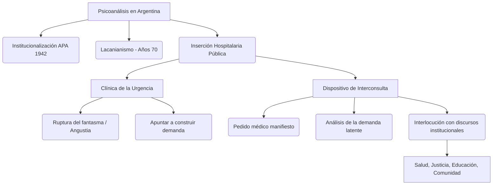

### 1. Tesis Central
La inserción del psicoanálisis en la Argentina, desde sus inicios pioneros hasta su consolidación en el ámbito público (especialmente en hospitales generales), ha requerido una constante reformulación de sus dispositivos clínicos. La intervención en la urgencia y el dispositivo de interconsulta demuestran la plasticidad del método psicoanalítico, donde la ética de hacer lugar al sujeto del inconsciente dialoga y se tensiona con el discurso médico e institucional, expandiendo la praxis hacia múltiples ámbitos de interlocución comunitaria, judicial y educativa.

### 2. Glosario de Conceptos Clave
| Concepto | Definición Clave en el Texto |
|----------|-----------------------------|
| Historia del Psicoanálisis en Argentina | Trayectoria que inicia con la fundación de la Asociación Psicoanalítica Argentina (1942), marcada por pioneros, y sufre una profunda transformación con la entrada de la enseñanza de Lacan (años 70), logrando una fuerte penetración en el ámbito hospitalario, la salud pública y la universidad. |
| Urgencia Psicoanalítica | Momento de quiebre en la homeostasis subjetiva y fracaso del fantasma frente a la irrupción de lo real, caracterizado por el desborde de angustia, el pasaje al acto o el acting out. La intervención busca introducir la pausa e historizar para que surja una demanda. |
| Dispositivo de Interconsulta | Práctica en el hospital general donde el psicoanalista es convocado por el equipo médico. Su función no es responder mecánicamente al pedido, sino alojar y descifrar la demanda (del paciente y del equipo tratante), interponiendo la dimensión subjetiva frente al discurso de la ciencia médica. |
| Ámbitos de Interlocución | Espacios (hospital general, escuela, sistema judicial, instituciones comunitarias) donde el psicoanálisis dialoga con otras disciplinas (medicina, derecho, pedagogía). Implica sostener la especificidad de la escucha psicoanalítica sin ceder al furor curandis ni al reduccionismo. |

### 3. Citas Críticas
> [!IMPORTANT]
> "La urgencia subjetiva no se superpone linealmente a la urgencia psiquiátrica o médica; es el tiempo de la angustia donde la palabra ha perdido su eficacia y el analista debe operar para restablecer el lazo transferencial y permitir el despliegue de una demanda."
> *Por qué es clave:* Diferencia el abordaje psicoanalítico de los protocolos médicos estándar, priorizando el lugar del sujeto y la formulación de una interrogación por sobre la mera supresión sintomática.

> [!IMPORTANT]
> "En la interconsulta, a menudo el paciente es el propio equipo médico; el psicoanalista interviene sobre los puntos ciegos de la institución y la angustia que suscita aquello que resiste al saber médico."
> *Por qué es clave:* Subraya que la intervención del analista no recae únicamente en el paciente internado, sino en la red discursiva e institucional que enmarca la consulta médica.

### 4. Mapa Conceptual

### 5. Preguntas de Autoevaluación
1. ¿Cuáles fueron los hitos fundamentales en la historia e inserción del psicoanálisis en la Argentina, desde sus inicios hasta su vasta entrada en el hospital público?
2. ¿Qué diferencia conceptual y clínica establece el psicoanálisis entre una "urgencia médica o psiquiátrica" y una "urgencia subjetiva"?
3. Explique el rol del psicoanalista en el dispositivo de interconsulta hospitalaria y cómo debe operar respecto a la demanda del equipo tratante.
4. Desarrolle cómo se piensa el abordaje de la angustia, el *acting out* y el pasaje al acto en la intervención psicoanalítica de urgencia.
5. Mencione y analice al menos tres ámbitos institucionales (más allá del consultorio privado) donde el psicoanálisis establece necesarias interlocuciones con otros discursos.
